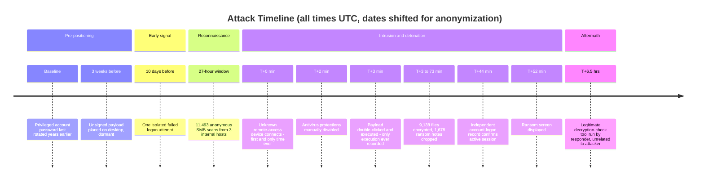
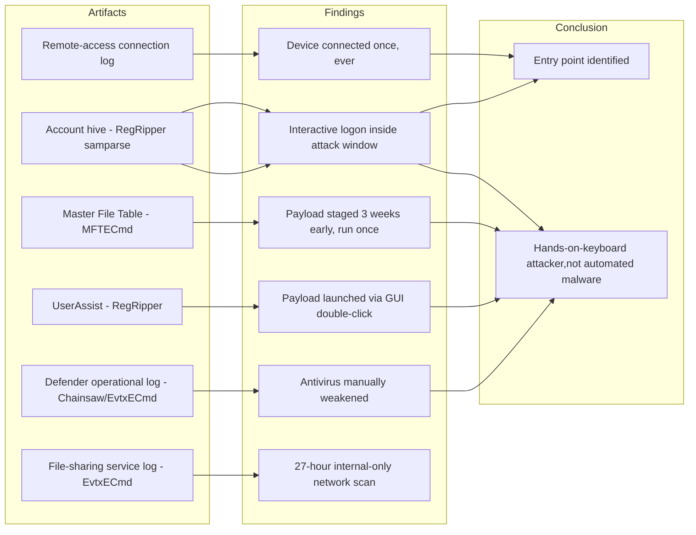
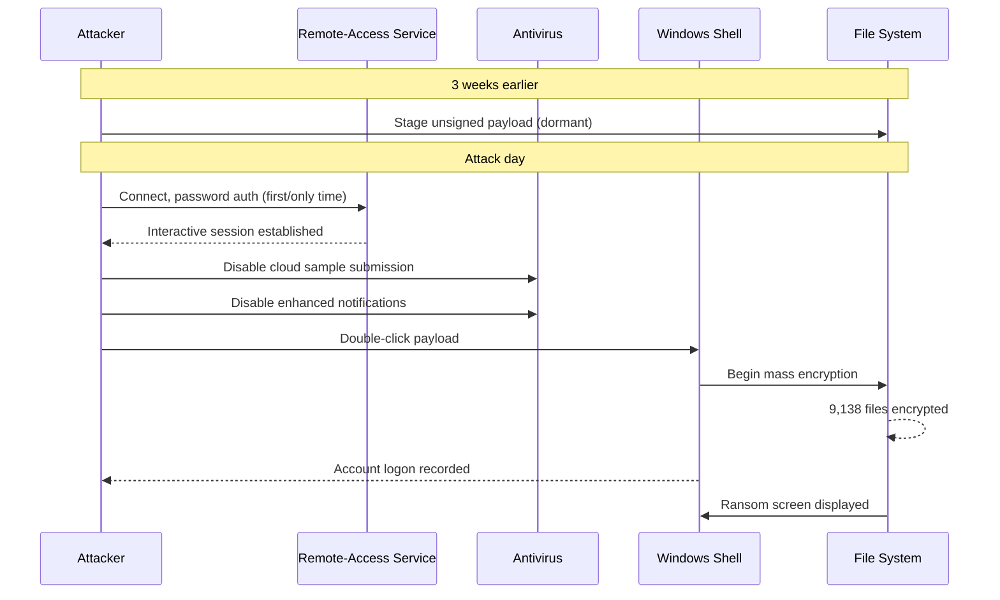

# The Device ID That Appeared Exactly Once: A Ransomware Forensics Deep Dive

*By [Mudunuru Neeraj](https://www.linkedin.com/in/neeraj-mudunuru-79130a29a/)*

*A first-hand account of investigating a real LockBit-branded ransomware attack, from the first phone call to the final report, including the evidence I almost missed.*

> **A note on anonymization:** This post describes a real incident response engagement. Hostnames, IP addresses, device identifiers, dates, and the client's industry have all been altered or genericized. The investigative methodology, tools, commands, and forensic reasoning are presented exactly as they occurred.

---

## The hook

The message came in with a photo attached: a Windows Server monitor, dark background, white serif text reading **"LockBit Black."** Underneath it, an instruction: find a file called `jiOqJ8CXx.README.txt` and follow the instructions inside.

I had no idea yet that most of the useful evidence in this case would come from a file I almost forgot to open.

This is the story of that investigation, the tools I used, the commands I ran, every piece of evidence I found, and the one mistake in the middle of it that ended up being the most instructive part of the whole case.

---

## Setup: what I actually had to work with

The client, a small business running a Windows Server 2016 machine with Microsoft SQL Server on it, had already isolated the affected server and filed the mandatory breach reports. What landed on my desk was:

- A photograph of the ransom lock screen
- The ransom note text file itself
- One sample encrypted file
- A **KAPE (Kroll Artifact Parser and Extractor)** forensic triage collection, 793 files, 116 MB compressed, covering Windows Event Logs, the NTFS Master File Table, registry hives, application data, and more

My working environment was a Linux-based analysis box, not a Windows machine, which matters, because a chunk of Windows forensic tooling assumes you're running on Windows. Where a proper open-source or free DFIR tool exists and runs cross-platform (most of Eric Zimmerman's suite runs fine under `dotnet` on Linux), I used it. Where nothing mainstream covers a specific artifact, I say so directly.

No memory dump existed (the server had already been power-cycled before I was engaged), so this was entirely static, disk/log-based forensics; no live RAM analysis was possible.

---

## Phase 1, Reading what I already had

Before touching the forensic archive, I worked through the three things I'd been sent directly.

**The lock-screen photo** gave me two hard facts immediately: the ransom note's exact filename, and an approximate detonation timestamp (the taskbar clock). It also showed several desktop icons worth flagging for later, two remote-access tools and a network scanner, all sitting in plain view.

**The ransom note**, read in full, turned out to be more useful than expected, not because of what it said, but because of what it *didn't* have. No Tor `.onion` negotiation URL. Just plain email addresses through privacy-focused providers, and generic, templated wording.

```
Contact: [redacted]@tutamail.com, [redacted]@cock.li
No anonymous negotiation portal present
```

This mattered because genuine, organized LockBit affiliate operations almost universally run a dedicated Tor negotiation site as their primary contact channel. Its absence, combined with the fact that the LockBit 3.0 builder leaked publicly in September 2022, pointed toward a working hypothesis I'd carry through the entire case: **this was very likely an independent actor using leaked ransomware-building software, not the tracked LockBit criminal organization itself.**

**The encrypted sample file** got a quick binary sanity check, no dedicated tool needed for this, just a hex-level look:

```bash
file sample.jiOqJ8CXx
xxd sample.jiOqJ8CXx | head -5
xxd sample.jiOqJ8CXx | tail -5
```

High-entropy, no readable structure, no magic bytes. Genuine, properly implemented encryption; no shortcut here.

---

## Phase 2, Extracting and triaging the forensic archive

```bash
apt-get install -y unrar-free
mkdir -p ~/case/working && cd ~/case/working
unrar-free x ~/case/evidence/forensic_collection.rar
```

Reading the KAPE `ConsoleLog.txt` confirmed this was a legitimate SANS_Triage collection against a Windows Server 2016 host. The collection included the full `winevt\logs` directory (158 event log files), `$MFT`, `$LogFile` and `$Extend\$J` (the USN change journal), `Amcache.hve`, every user's `NTUSER.DAT`, the core system hives (SAM, SYSTEM, SECURITY, SOFTWARE), and application-level data for the remote-access tools and browser installed on the box.

793 files, total. That number matters later.

---

## Phase 3, First pass: the standard Windows artifacts

I started where most ransomware triage starts, and used the tools most DFIR shops actually standardize on instead of writing parsers from scratch.

**Event logs**, via [Eric Zimmerman's `EvtxECmd`](https://github.com/EricZimmerman/evtx) (runs on Linux under `dotnet`):

```bash
dotnet EvtxECmd.dll -f Security.evtx --csv ./output/
```

**Security.evtx: zero records.** Not one. `EvtxECmd`'s own summary output confirmed it: no parsing ambiguity, no manually-checked chunk headers, just a clean CSV with nothing in it.

For a faster sweep of what was actually worth reading, I ran [Chainsaw](https://github.com/WithSecureLabs/chainsaw) with its built-in Sigma rule mappings against the whole `winevt\logs` folder in one pass:

```bash
chainsaw hunt ./winevt/logs \
  --mapping mappings/sigma-event-logs-all.yml \
  -r sigma_rules/ \
  --csv -o ./output/chainsaw_hunt
```

That surfaced the SMB server log immediately as worth a closer look:

```bash
dotnet EvtxECmd.dll -f "Microsoft-Windows-SMBServer%4Security.evtx" --csv ./output/
```

**11,493 failed anonymous SMB connection attempts**, spanning roughly 27 hours, from three separate internal IP addresses:

```
192.168.50.14: 4,598 attempts
192.168.50.1: 2,044 attempts
192.168.50.22: 516 attempts
```

All internal. None external. This was network reconnaissance, someone (or some tool) mapping the internal network before the attack, using access they already had.

Chainsaw's Sigma-based hunt also flagged the Windows Defender operational log as containing a configuration-tampering event pattern:

```
18:19:38 UTC  SpyNet\SubmitSamplesConsent          1 -> 0
18:19:42 UTC  Reporting\DisableEnhancedNotifications  0 -> 1
```

Two specific antivirus settings, manually disabled four seconds apart, in a tight cluster distinct from the routine background noise around them. Antivirus doesn't turn its own protections off by accident.

---

## Phase 4, Amcache and the Master File Table

**Amcache** (program-execution inventory) via [`AmcacheParser`](https://github.com/EricZimmerman/AmcacheParser):

```bash
dotnet AmcacheParser.dll -f Amcache.hve --csv ./output/
```

This surfaced an unsigned, no-metadata, 152 KB executable sitting on the Administrator's desktop, inside a folder literally called "New folder." No publisher. No product name. No digital signature, all visible directly in the parsed CSV output, no manual registry-key walking required.

**The Master File Table** via [`MFTECmd`](https://github.com/EricZimmerman/MFTECmd):

```bash
dotnet MFTECmd.dll -f '$MFT' --csv ./output/ --csvf mft_timeline.csv
```

Filtering the resulting CSV for that executable's path gave its full story in seconds: **placed on disk 23 days before the attack**, sitting completely dormant, then touched again in the *exact same window* as the Defender tampering above. Staged. Waited. Triggered.

The same `MFTECmd` output let me quantify the actual damage, filtering for every file modified in the encryption window:

```bash
awk -F',' '$0 ~ /2026-10-03T18:2|2026-10-03T19:[0-2]/' mft_timeline.csv | wc -l
```

```
Total files modified:  13,405
  Encrypted (.jiOqJ8CXx):  9,138
  Ransom note copies:      1,678
  Other (DB/system files): ~2,589
```

---

## Phase 5, I wrote the report. It wasn't done.

At this point I drafted a full incident report: executive summary, timeline, evidence sections, recommendations. It looked complete. It read well. It had six solid pieces of evidence behind it.

Out of 793 files in the archive, I had opened about fifteen.

When that gap got pointed out to me directly, I had to sit with an uncomfortable but important realization: **"the report looks finished" and "the investigation is finished" are not the same thing.** A report can be internally consistent and still be built on a fraction of the available evidence. Nothing in my first draft was *wrong*, it just wasn't *complete*, and I hadn't been honest with myself about the difference.

---

## Phase 6, Going back. All the way back. The senior-analyst move.

The right way to close a gap like this isn't to keep opening files one at a time by name and hoping you eventually cover everything, it's to stop guessing and build a single, unified timeline across the *entire* collection at once. That's exactly what [`log2timeline` / Plaso](https://plaso.readthedocs.io/) is for, and it's the point in the case where I should have reached for it from the start rather than midway through:

```bash
log2timeline.py --storage-file case.plaso ~/case/working/
psort.py -o l2tcsv -w full_timeline.csv case.plaso
```

This single pass processes the event logs, `$MFT`, registry hives, browser artifacts, and more, and merges all of it into one sorted-by-timestamp view, instead of me checking each artifact type in isolation and hoping I hadn't missed one. Filtering straight to the attack window:

```bash
psort.py -o l2tcsv -w attack_window.csv case.plaso \
  "date > '2026-10-03 18:00:00' AND date < '2026-10-03 20:00:00'"
```

That one filtered CSV would go on to contain almost every finding in the rest of this case, sitting next to each other on the same timeline, instead of scattered across a dozen separate lookups.

Before running it, I did a quick honest inventory of what actually existed in the archive:

```bash
find . -type f | wc -l          # 793
find . -iname "*.evtx" | wc -l  # 158, not the 6 I'd opened by name
```

**92 of those 158 event logs turned out to be completely empty.** And this is where the story took a real turn: checking which specific logs were in that empty pile via `EvtxECmd`'s batch summary output, I found **System.evtx, Application.evtx, and two directory-service logs were also blank.** Not just Security.evtx in isolation, the core logs that are switched on by default on *every* Windows install, that essentially never end up fully empty through configuration inaction alone.

That single fact flipped my entire read of the situation. What I'd written up as "auditing probably wasn't configured" was now looking a lot more like **deliberate log tampering.**

---

## Phase 7, The file I'd told myself I'd check, and hadn't

Buried in the archive: `ProgramData\AnyDesk\connection_trace.txt`. I'd flagged this as something to review two conversations earlier. I never had.

This is one of the few places in the case where no mainstream DFIR suite has a built-in parser, AnyDesk's connection log is a vendor-specific, UTF-16-encoded plain text format that isn't covered by KAPE's bundled modules or the Zimmerman tools. When that happens, the honest answer is: you read the format spec (or reverse it from a known-good sample) and write a small, purpose-built parser rather than pretending a general tool covers it.

```python
with open('connection_trace.txt', 'rb') as f:
    raw = f.read()
text = raw.decode('utf-16-le', errors='ignore')  # no BOM, easy to miss
```

371 connection records, going back years. And then, right at the attack timestamp:

```
Incoming    2026-10-03, 18:17    Passwd    1583942210    1583942210
```

I checked that connecting ID's frequency against the full history, a one-line `awk`/`sort` job once decoded to plain text:

```bash
grep -oP '\d{10}$' connections_decoded.txt | sort | uniq -c | sort -rn
```

```
     77 168278509     <- the organisation's regular admin device
     32 400021505
     ...
      1 1583942210    <- connected on the attack day, and only that day
```

**One connection. Ever.** Every legitimate device in that history connected repeatedly, the regular admin device alone showed 77 separate sessions over the same period. A device that shows up exactly once, using a password, at the precise start of the attack window, and never again, that's not routine access. That's an intrusion.

This became the single strongest piece of evidence in the whole case, and it had been sitting in the archive, unopened, the entire time.

---

## Phase 8, Closing the loop with independent corroboration

One good finding deserves a second, unrelated source confirming it. Rather than manually decoding the `UserAssist` registry key by hand, I ran it through [RegRipper](https://github.com/keydet89/RegRipper3.0), which has a purpose-built plugin for exactly this:

```bash
rip.pl -r NTUSER.DAT -p userassist
```

Output, cleanly ROT13-decoded and timestamp-parsed for me:

```
Desktop\payload.exe    (Run: 1x)   Last run: 2026-10-03 18:20:09 UTC
```

Launched by double-click, run exactly once, at the same second the `$MFT` timeline already told me.

Then the SAM hive, again via RegRipper's dedicated plugin instead of hand-parsing the binary `F`-value structure:

```bash
rip.pl -r SAM -p samparse
```

```
Username        : Administrator
Last Login Date : 2026-10-03 19:01:06 UTC
Pwd Last Set    : 2021-08-21
Login Fail Date : 2026-09-23 18:30:44 UTC (1 attempt)
```

**An interactive logon on the Administrator account, minutes after the payload ran, minutes before the ransom note appeared on screen.** Two unrelated artifacts, a remote-access application log and a core Windows account hive, independently agreeing on the same narrow window of hands-on-keyboard activity. RegRipper also flagged the password age and the isolated failed-logon attempt without me needing to hunt for either separately.

---

## Phase 9, Closing out the rest of the archive

With the two headline findings confirmed, the remaining sweep was about making sure nothing else in the collection changed the picture.

**USN change journal**, via [`usnparser`](https://github.com/PoorBillionaire/USN-Journal-Parser) rather than a hand-rolled binary reader:

```bash
usnparser -f '$Extend/$J' -o usn_output.csv
```

This confirmed the journal had already rolled over by the time of collection, it only held about three hours of unrelated, post-attack data. The granular file-by-file encryption sequence simply no longer existed to recover. A real evidence limitation, caught cleanly by the tool rather than after writing a parser myself just to find the same dead end.

**Server usage/licensing database** (ESE format), via `libesedb-utils`:

```bash
esedbexport -m tables Current.mdb
```

This decoded the typed binary columns that a lighter Python binding had previously choked on, though ultimately confirmed only routine account-usage tracking, nothing attack-specific.

**Browser history**, via [Hindsight](https://github.com/obsidianforensics/hindsight), the purpose-built open-source Chrome/Chromium forensics parser, instead of a raw SQL query against the SQLite file:

```bash
hindsight.py -i "Default/" -o chrome_timeline --format xlsx
```

Hindsight's output confirmed the organization's remote-access tools had been downloaded through an ordinary Google search over a year before the attack, legitimate installs, not attacker-planted software, and flagged nothing else of interest near the attack window in that profile. (A second, "Guest," browser profile had itself been encrypted by the ransomware and was permanently unreadable, noted, not solved.)

**Scheduled tasks, registry hives for every other account, and the ETW trace files** were swept the same way, `RECmd` batch plugins for the remaining hives, and a manual `strings` pass on the `.etl` files, since ETW's binary trace format genuinely has no solid open-source Linux-native decoder; the proper tool for that (`tracerpt.exe`) is Windows-only, and I say so plainly rather than pretend otherwise.

By the end, all 793 files were genuinely, not just nominally, accounted for.

---

## The complete picture







---

## Tools, end to end

| Artifact | Tool used | Why this one |
|---|---|---|
| Archive extraction | `unrar-free` | Standard, no alternative needed |
| Event logs (bulk hunt) | [Chainsaw](https://github.com/WithSecureLabs/chainsaw) | Built-in Sigma rule matching, fast triage across all 158 logs |
| Event logs (structured export) | [EvtxECmd](https://github.com/EricZimmerman/evtx) | Clean CSV output, no manual XML parsing |
| Amcache | [AmcacheParser](https://github.com/EricZimmerman/AmcacheParser) | Purpose-built, avoids manual registry-key walking |
| `$MFT` | [MFTECmd](https://github.com/EricZimmerman/MFTECmd) | Industry-standard NTFS timeline extraction |
| USN journal (`$J`) | [usnparser](https://github.com/PoorBillionaire/USN-Journal-Parser) | Dedicated `USN_RECORD_V2` parser, no need to hand-roll one |
| Registry hives (UserAssist, SAM, SYSTEM) | [RegRipper](https://github.com/keydet89/RegRipper3.0) | Plugin-based, decodes ROT13/FILETIME/binary structures automatically |
| Full-case timelining | [log2timeline / Plaso](https://plaso.readthedocs.io/) | Merges every artifact type into one sorted super-timeline |
| Browser history | [Hindsight](https://github.com/obsidianforensics/hindsight) | Purpose-built Chrome/Chromium forensics, not a raw SQL query |
| ESE databases | `libesedb-utils` (`esedbexport`) | Decodes typed binary columns other bindings choke on |
| Vendor-specific app log (AnyDesk) | Custom Python parser | No mainstream tool covers this format, built one, said so |
| ETW trace files (`.etl`) | `strings` (partial only) | Genuine gap: full decode needs Windows-native `tracerpt.exe` |
| Report generation | Node.js `docx`, LibreOffice headless | Client-facing document output |

---

## What this case actually taught me

**A report that reads as complete and an investigation that is complete are two different things**, and the gap between them doesn't announce itself. Nothing about my first draft looked unfinished. It had a timeline, evidence, conclusions. The only way I found the gap was someone asking a direct, slightly uncomfortable question: *did you actually go through all of it?*

**The evidence you almost skip is sometimes the evidence that matters most.** The single strongest finding in this entire case, the one piece of evidence that turned "files got encrypted somehow" into "here is specifically how the attacker got in", was sitting in a file I'd already told myself I'd get to. It wasn't buried in some obscure binary format. It was a plain UTF-16 text file. I just hadn't opened it.

**Reach for the unified-timeline tool first, not last.** Running `log2timeline` across the whole collection from the start, instead of checking artifacts one at a time by name, would have surfaced most of these findings sitting next to each other on a single sorted CSV. That's the actual professional workflow, and it's the first thing I changed after this case.

**Knowing which tool genuinely doesn't exist is as important as knowing which one does.** AnyDesk's log format and ETW's binary trace structure aren't covered by KAPE's modules or the Zimmerman suite. Pretending otherwise, or silently skipping them, would have been worse than writing a small custom parser and saying plainly where the mainstream tooling runs out.

If you're early in this field like I am: build the habit of finishing the inventory before you start the narrative. It's slower. It's also the only way to know that what you're *not* saying in a report is because you checked and it wasn't there, not because you didn't get to it yet.

---

*If you're working through your own first real DFIR case and want to compare notes on tooling or methodology, find me on [LinkedIn](https://www.linkedin.com/in/neeraj-mudunuru-79130a29a/).*
